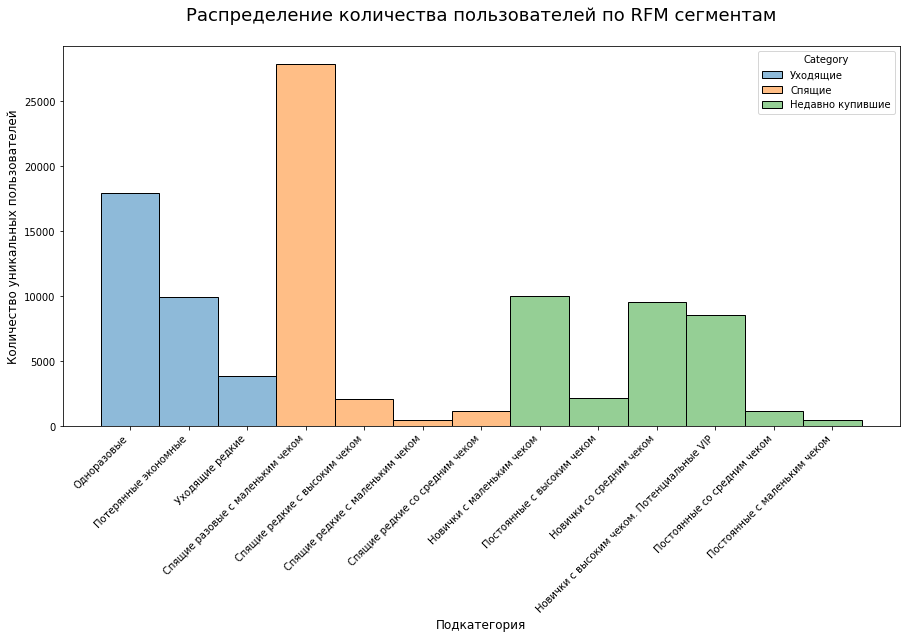

<h2>Задача</h2>

1. Скачать несколько файлов с информацией о клиентах и их заказах с Яндекс.Диск.
2. На основе информации провести RFM сегментацию, так чтобы была возможность выгрузить id пользователей по определённым сегментам.
3. Предложить что можно сделать с каждым сегментом.
4. Построить распределение по сегментам.

<h2>Что сделал</h2>

1. Прочитал файл с Яндекс.Диска с помощью API и сохранил в переменные.
2. Приготовил данные для работы: отобрал только нужные столбцы, перевёл в нужные типы данных, добавил недостающие столбцы.
3. Посчитал recency, frequency, monetary по каждому пользователю.
4. Сформировал файл с id пользователя и соответствующим RFM сегментом. Данная таблица доступна в переменной df_final_rfm 
5. Построил распределение пользователей по сегментам

<h2>Выводы</h2>

Вывод: с каждый сегментом нужно работать индивидуально. Методы работы описал в таблице ниже [«Логика RFM сегментации»](RFM.ipynb).

